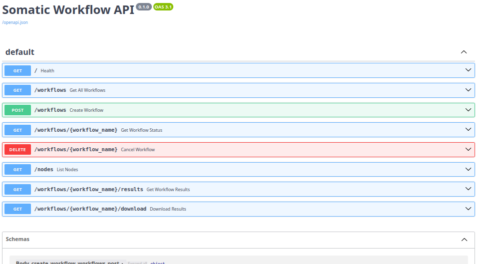

# Somatic Workflow API --- Task III

## Overview

This project implements a REST API service that provides a user-friendly
interface for submitting and managing somatic variant classification
workflows running on Argo Workflows inside a Kubernetes (k3d) cluster.

The API acts as a bridge between end users and the workflow
orchestration layer built in Task II.

This service enables:

-   Workflow submission (file upload or reference mode)
-   Node selection for execution
-   Workflow status monitoring
-   Result retrieval and download
-   Workflow cancellation
-   Cluster node inspection

This project depends on the infrastructure established in Task II:
https://github.com/khan1094/germline-somatic-classifier-containerization-orchestration

Task II must be fully deployed and operational before using this API.

------------------------------------------------------------------------

## Architecture

```
Client → FastAPI Service → Argo Server → Workflow Pod → Shared /refdata Storage
```

The API runs inside the Kubernetes cluster and communicates with Argo
using the internal service DNS:

```
https://argo-server.argo.svc.cluster.local:2746
```

Reference data and results are stored on a shared host-mounted volume
at:

```
/refdata
```
------------------------------------------------------------------------

## Repository Structure

The repository should have the following structure:

    somatic-workflow-api/ 
    │ 
    ├── app/ 
        │ 
        ├── main.py 
        │ 
        ├── argo_client.py 
        │
        ├── kube_client.py 
        │ 
        ├── models.py 
        │ 
        └── utils.py 
    │ 
    ├── k8s/ 
        │ 
        ├──deployment.yaml 
        │ 
        └── service.yaml 
        │ 
        └── rbac.yaml 
    │ 
    ├── Dockerfile 
    ├── requirements.txt
    └── README.md

------------------------------------------------------------------------

# Prerequisites (Task II Verification)

Before deploying the API service (Task III), verify that the full Task II infrastructure is correctly installed and operational.

The following components must already be configured:

- k3d multi-node Kubernetes cluster
- Argo Workflows installed and running
- WorkflowTemplate deployed
- Shared /refdata volume mounted
- Successful workflow execution from Task II

Each of the following checks must pass.

---

## 1. Verify k3d Cluster is Running

Run:

```bash
kubectl get nodes
```

Expected output (1 server + 3 agents in Ready state):

```bash
NAME                           STATUS   ROLES                  AGE   VERSION
k3d-somatic-cluster-agent-0    Ready    <none>                 10d   v1.31.5+k3s1
k3d-somatic-cluster-agent-1    Ready    <none>                 10d   v1.31.5+k3s1
k3d-somatic-cluster-agent-2    Ready    <none>                 10d   v1.31.5+k3s1
k3d-somatic-cluster-server-0   Ready    control-plane,master   10d   v1.31.5+k3s1
```

All nodes must be in **Ready** state.

---

## 2. Verify Argo Workflows is Running

Run:

```bash
kubectl get pods -n argo
```

Expected output should include:

```bash
NAME                                   READY   STATUS    RESTARTS   AGE
argo-server-xxxxxxxxx-xxxxx            1/1     Running   0          10d
workflow-controller-xxxxxxxxx-xxxxx    1/1     Running   0          10d
```

Both argo-server and workflow-controller must be in Running state.

---

## 3. Verify WorkflowTemplate Exists (Task II)

Run:

```bash
kubectl get workflowtemplates -n argo
```

Expected output:

```bash
NAME                           AGE
somatic-classifier-template    10d
```

The template created in Task II must be present.

---

## 4. Verify Previous Workflow Executions

Run:

```bash
kubectl get workflows -n argo
```

Expected output should show previously executed workflows from Task II:

```bash
NAME                                STATUS      AGE
somatic-classifier-template-xxxxx   Succeeded   9d
somatic-classifier-template-yyyyy   Succeeded   9d
```

At least one workflow should be in Succeeded state.

---

## 5. Verify Shared /refdata Volume on Host

Task II mounted the shared storage using:

```bash
k3d cluster create somatic-cluster \
  --agents 3 \
  --volume ~/refdata:/refdata@all
```

Verify that the host directory exists:

```bash
ls ~/refdata
```

Expected structure:

```bash
gnomad4_1pct.vcf.gz
gnomad4_1pct.vcf.gz.tbi
hg38_cosmic91.txt.gz
hg38_cosmic91.txt.gz.tbi
samples/
results/
```

Verify that results were generated in Task II:

```bash
ls ~/refdata/results
```

Expected:

```bash
somatic-classifier-template-xxxxx.tsv
```

This confirms that:

- The shared volume exists
- Workflow pods successfully wrote output
- The infrastructure is fully functional

---

Only after all the above checks pass should Task III deployment begin.

---------------------------------------------------------------------------

## Build and Deploy

### 1. Build Docker Image

```bash
docker build -t somatic-api:latest .

```

Expected Output:

```bash
[+] Building 125.4s (12/12) FINISHED                            docker:default
 => [internal] load build definition from Dockerfile                    0.0s
 => => transferring dockerfile: 390B                                    0.0s
 => [internal] load metadata for docker.io/library/python:3.10-slim     2.0s
 ...
```

### 2. Import Image into k3d

```bash
k3d image import somatic-api:latest -c somatic-cluster
```
Expected Output:

```bash
...
INFO[0058] Removing the tarball(s) from image volume... 
INFO[0060] Removing k3d-tools node...                   
INFO[0060] Successfully imported image(s)               
INFO[0060] Successfully imported 1 image(s) into 1 cluster(s)

```

### 3. Deploy to Kubernetes

```bash
kubectl apply -f k8s/rbac.yaml
kubectl apply -f k8s/deployment.yaml
kubectl apply -f k8s/service.yaml
```

Expected Output:

```bash
serviceaccount/somatic-api-sa created
clusterrole.rbac.authorization.k8s.io/somatic-api-role created
clusterrolebinding.rbac.authorization.k8s.io/somatic-api-binding created

deployment.apps/somatic-api created

service/somatic-api created
```

### 4. Verify Deployment

```bash
kubectl get pods -n argo
```

The somatic-api pod must be in Running state.

Expected Output:

```bash
NAME                                   READY   STATUS      RESTARTS      AGE
argo-server-56557c5896-ktmr5           1/1     Running     3 (26h ago)   9d
somatic-api-66ff4d597-k77mp            1/1     Running     0             16h
workflow-controller-788b597c74-tknn2   1/1     Running     3 (26h ago)   10d
```


### 5. Access API (Local Development)

```bash
kubectl port-forward svc/somatic-api -n argo 8000:8000
```

Open in browser:

```
http://localhost:8000/docs
```



------------------------------------------------------------------------

# API Endpoints

After Build and Deploy section is completely applied, this section explains how to interact with the API both:

- Using Swagger UI (browser-based interface)
- Using curl (command-line HTTP client)

Swagger UI is available at:

```
http://localhost:8000/docs
```

All examples below assume the API is accessible via:

http://localhost:8000

---

## 1. List Cluster Nodes

Endpoint:

GET /nodes

Returns available Kubernetes nodes.

Swagger UI:

1. Open GET /nodes
2. Click "Try it out"
3. Click Execute

Expected Response:

```json
[
  {
    "name": "k3d-somatic-cluster-agent-0",
    "status": "Ready"
  },
  {
    "name": "k3d-somatic-cluster-agent-1",
    "status": "Ready"
  },
  {
    "name": "k3d-somatic-cluster-agent-2",
    "status": "Ready"
  },
  {
    "name": "k3d-somatic-cluster-server-0",
    "status": "Ready"
  }
]
```

## 2. Submit Workflow

Endpoint: 

```
POST /workflows
```

This endpoint submits a new classification workflow to Argo. This endpoint includes 3 inputs as follows:

```
- sample_vcf (string, filename located in /refdata/samples/ e.g., CO8-PA-26_mutect2_vlod.vcf.gz)
- node (string, Kubernetes node name, such as k3d-somatic-cluster-agent-1)
- file (upload a VCF file)
```

Two modes are supported.

### Mode A — Upload

Used when the user uploads a new VCF file.

Parameters:

- file (required): gzipped VCF file (.vcf.gz)
- node (optional): Kubernetes node name

How to test in Swagger UI:

1. Open POST /workflows
2. Click "Try it out"
3. Click the "file" field and select a .vcf.gz file
4. Optionally enter a node name
5. Click Execute

### Mode B — Reference

Used when the VCF file already exists in:

/refdata/samples/

Parameters:

- sample_vcf (required): filename located in /refdata/samples/
- node (optional): Kubernetes node name

How to test in Swagger UI:

1. Open POST /workflows
2. Click "Try it out"
3. Enter sample_vcf filename with it's extension in the path of /refdata/samples (e.g., CO8-PA-26_mutect2_vlod.vcf.gz)
4. Optionally enter node
5. Click Execute

Example using curl (Reference Mode):

```bash
curl -X POST "http://localhost:8000/workflows" \
  -H "Content-Type: application/x-www-form-urlencoded" \
  -d "sample_vcf=CO8-PA-26_mutect2_vlod.vcf.gz" \
  -d "node=k3d-somatic-cluster-agent-1"
```

Explanation of curl parameters:

- -X POST → specifies HTTP method
- -H → sets HTTP headers
- -d → sends form data in the request body

Expected Response:

```json
{
  "workflow_name": "somatic-api-xxxxx",
  "status": "Pending",
  "node": "k3d-somatic-cluster-agent-1" #if node name is entered, else null 
}
```

Note: You should copy this output's workflow_name to put inputs of the following sections in Swagger UI:

    * GET /workflows/{workflow_name}                  (get workflow status)
    * GET /workflows/{workflow_name}/results          (get workflow results)
    * GET /workflows/{workflow_name}/download         (download results)

---

## 3. List Workflows

Endpoint:

GET /workflows

Returns all submitted workflows.

Swagger UI

1. Open GET /workflows
2. Click "Try it out"
3. Optionally provide the following parameters:

* status (string, optional): Filter workflows by phase. Accepted values include: Pending, Running, Succeeded, Failed, Error.
* limit (integer, optional, default = 20): Maximum number of records to return.
* offset (integer, optional, default = 0): Starting index for pagination.

4. Click Execute

If no parameters are provided, the endpoint returns the first 20 workflows.

Expected Response:

```json
[
  {
    "name": "somatic-api-lbdhq",
    "status": "Succeeded",
    "created_at": "2026-02-28T04:25:49Z",
    "started_at": "2026-02-28T04:25:49Z",
    "finished_at": "2026-02-28T04:26:43Z",
    "input_sample": "CO8-MA-27_mutect2_vlod.vcf.gz",
    "node": "k3d-somatic-cluster-agent-1"
  }
]
```
Response Fields

* name → Workflow identifier
* status → Current workflow phase
* created_at → Workflow creation timestamp
* started_at → Execution start time
* finished_at → Execution completion time
* input_sample → VCF file used as input
* node → Kubernetes node where the workflow executed
---

## 4. Get Workflow Status

Endpoint:

GET /workflows/{workflow_name}

Returns detailed status information.

Swagger UI:

1. Open GET /workflows/{workflow_name}
2. Click "Try it out"
3. Enter workflow_name (for example, `somatic-api-6cjkn`)
4. Click Execute

Expected Response:

```json
{
  "name": "somatic-api-xxxxx",
  "status": "Succeeded",
  "created_at": "2026-02-28T00:52:20Z",
  "started_at": "2026-02-28T00:52:26Z",
  "finished_at": "2026-02-28T00:52:46Z",
  "duration_seconds": 20.0,
  "progress": "1/1",
  "input_sample": "CO8-PA-26_mutect2_vlod.vcf.gz",
  "node": "k3d-somatic-cluster-agent-1",
  "error_message": null
}
```

---

## 5. Get Workflow Results

Endpoint:

GET /workflows/{workflow_name}/results

Returns summary statistics and output file path for completed workflows.

Swagger UI:

1. Open GET /workflows/{workflow_name}/results
2. Click "Try it out"
3. Enter workflow_name
4. Click Execute

Expected Response:

```json
{
  "workflow_name": "somatic-api-lbdhq",
  "status": "Succeeded",
  "output_file": "/refdata/results/somatic-api-lbdhq.tsv",
  "summary": {
    "LIKELY_GERMLINE": 725,
    "UNKNOWN": 1751,
    "CONFLICTING": 169,
    "LIKELY_SOMATIC": 58
  }
}
```

---

## 6. Download Results

Endpoint:

GET /workflows/{workflow_name}/download

Downloads the raw TSV result file.

Swagger UI:

1. Open GET /workflows/{workflow_name}/download
2. Click "Try it out"
3. Enter workflow_name
4. Click Execute
5. Click the generated download link

The TSV file will be downloaded to your local machine.

---

## 7. Cancel Workflow

Endpoint:

DELETE /workflows/{workflow_name}

Stops and deletes a workflow.

Swagger UI:

1. Open DELETE /workflows/{workflow_name}
2. Click "Try it out"
3. Enter workflow_name
4. Click Execute

Expected Response:

```json
{ "message": "Workflow deleted" }
```

---


## Design Decisions

This implementation follows a simple and explicit architecture aligned with the requirements of Task III.

- Direct REST communication with Argo Workflows API using HTTP requests.
  Hera SDK was intentionally not used in order to keep dependencies minimal and maintain full visibility over request payloads.

- Kubernetes-native deployment model.
  The API runs inside the cluster and communicates with Argo using the internal service DNS:
  https://argo-server.argo.svc.cluster.local:2746

- Dedicated ServiceAccount and RBAC configuration.
  A custom ServiceAccount (somatic-api-sa) with a ClusterRole and ClusterRoleBinding
  is used to allow read-only access to cluster nodes. This ensures adherence
  to Kubernetes security practices.

- HostPath volume usage.
  The /refdata directory is mounted into the API pod to ensure consistency with Task II,
  where reference data and results are stored on the host and shared across cluster nodes.

- Stateless API design.
  The API does not store workflow state internally. All workflow status and metadata
  are retrieved directly from Argo. This keeps the service lightweight and reproducible.

- OpenAPI documentation via FastAPI.
  Automatic documentation is available at /docs for interactive testing and validation.

------------------------------------------------------------------------

## Known Limitations

The current implementation intentionally keeps scope limited to Task III requirements.

- No authentication or authorization layer for end users.
- Real-time updates are implemented using client-side polling via GET /workflows/{workflow_name}. No SSE or WebSocket streaming is implemented.
- Completed workflows are not automatically cleaned up from the cluster.
- File validation is basic (extension and gzip structure check only).

These limitations are acceptable for the scope of this technical assignment.

------------------------------------------------------------------------

## Verification Workflow

The following sequence verifies correct end-to-end functionality after deployment.

1. Submit workflow via Swagger UI:
   POST /workflows (Reference or Upload mode)

2. Confirm workflow creation:
   kubectl get workflows -n argo

3. Confirm pod execution:
   kubectl get pods -n argo -o wide

4. Verify workflow status via API:
   GET /workflows/{workflow_name}

   Ensure the response includes:
    - duration_seconds
    - input_sample
    - node
    - progress

6. Retrieve summarized results:
   GET /workflows/{workflow_name}/results

7. Download raw TSV file:
   GET /workflows/{workflow_name}/download

8. Verify results file exists on host:
   ls ~/refdata/results

------------------------------------------------------------------------

## Environment Variables

The API container relies on the following environment variables:

```
UPLOAD_DIR=/refdata/samples  
ARGO_HOST=https://argo-server.argo.svc.cluster.local:2746
```

These variables are configured inside k8s/deployment.yaml.

## Override Capability

Although the current implementation does not require overriding these values,
they can be modified at deployment time if needed.

- Example (override ARGO_HOST):

```
kubectl set env deployment/somatic-api -n argo ARGO_HOST=https://custom-argo-endpoint:2746
```

- Example (override UPLOAD_DIR):

```
kubectl set env deployment/somatic-api -n argo UPLOAD_DIR=/custom/path
```

- After modification, restart the deployment:

```
kubectl rollout restart deployment somatic-api -n argo
```

For this assignment and cluster configuration, no override is necessary.
The defaults are aligned with the Task II infrastructure.
